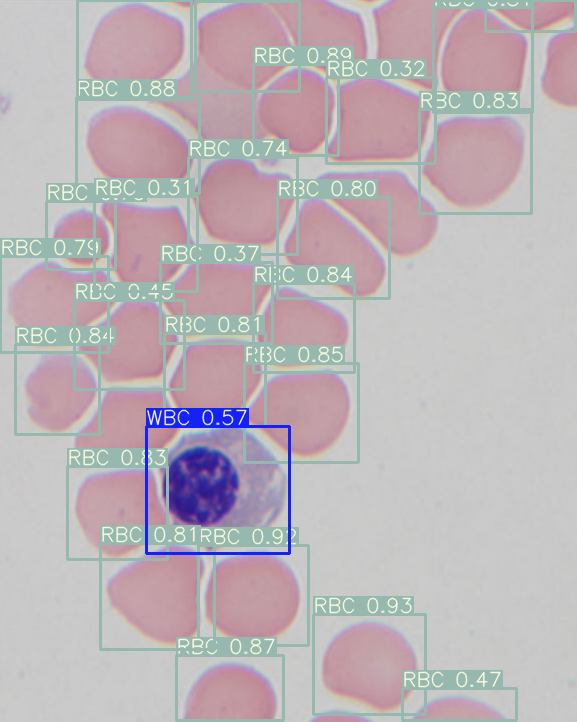
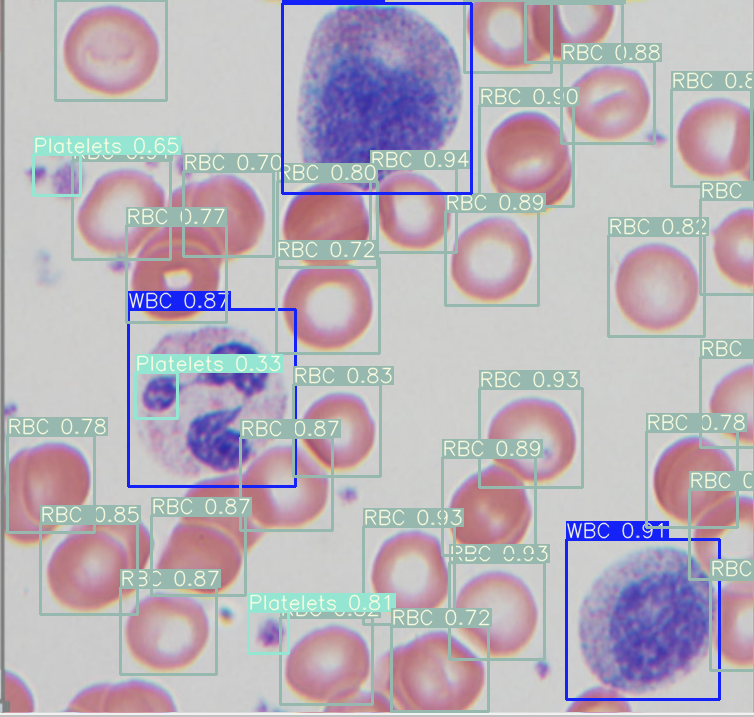
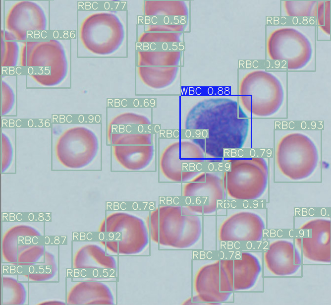
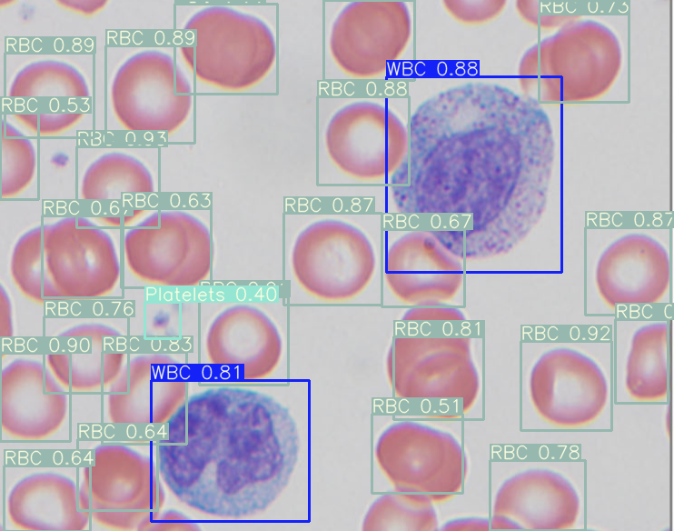

# AI-enabled Automated Microscopic Pathology

## 1.Test various detectors for blood based diagnosis.

### Test Results on COVID-19 Samples

   

### Cite this paper:
Xia, Tiancheng; Fu, Richard; Jin, Nanlin; Chazot, Paul; Angelov, Plamen; Jiang, Richard (2020): AI-enabled microscopic blood analysis for microfluidic COVID-19 haematology. The 6th International Conference on Computational Intelligence and Applications (ICCIA 2020), June 2020, Beijing, China. TechRxiv: https://doi.org/10.36227/techrxiv.12580583.v1.
